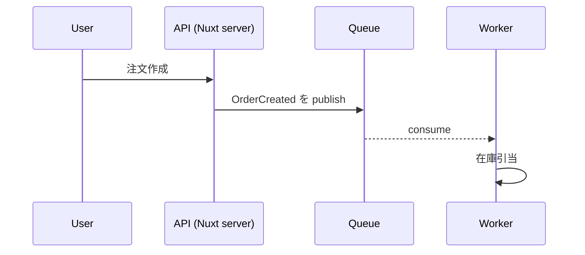

# アーキテクチャ

> **未決事項**：メッセージングは SQS FIFO と Kafka のどちらにするか未決定。

```mermaid
sequenceDiagram
  participant U as User
  participant API as API (Nuxt server)
  participant Q as Queue
  participant W as Worker
  U->>API: 注文作成
  API->>Q: OrderCreated を publish
  Q-->>W: consume
  W->>W: 在庫引当
```