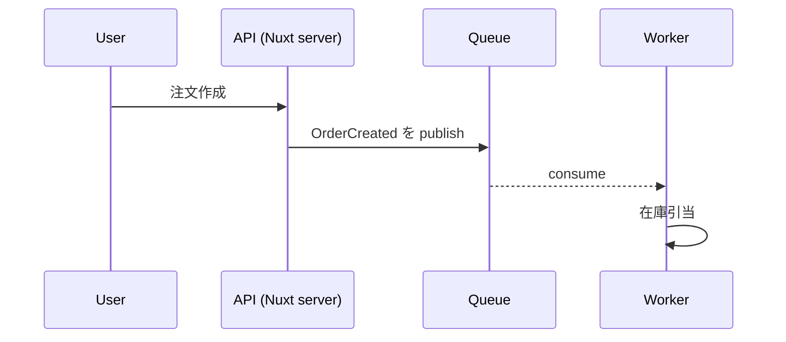

# GitHub Pages × Zensical ハンズオン — /docs の設計資料をサイト化する

Oct 4, 2026 · @KUMA

## 0. ゴールと前提

このハンズオンを終えると、リポジトリの `/docs` 配下にある設計資料（Markdown）が、`main` に push するだけで検索・ナビ付きのドキュメントサイトとして GitHub Pages に自動公開される状態になります。

**想定シチュエーション**：AI-DLC で生成・更新される要件定義や設計資料（`docs/` 配下の Markdown 群）を、GitHub 上でファイルを1つずつ開くのではなく、チームやクライアントがブラウザでサイトとして閲覧できるようにしたい。

**進め方**：まず素の GitHub Pages で「公開の仕組み」を体感し、次に Zensical でサイトの見た目と構造を整え、最後に GitHub Actions で自動デプロイまでつなげます。

**構成方針**：`docs/` は AI が読むコンテキスト（Markdown）だけを置く場所として純粋に保ち、GitHub Pages 用のファイル（Zensical の設定、トップページ、CSS など）は `website/` に分離します。ビルド時に両者を一時フォルダへ合体させてサイトを生成します。

```text
repo/
├─ docs/                  # AI 用コンテキストのみ（Zensical 関連は置かない）
├─ website/               # GitHub Pages 用
│  ├─ zensical.toml
│  ├─ build.sh            # docs/ と content/ を合体してビルド
│  └─ content/            # サイト専用ファイル（トップページ・CSS・画像）
└─ .github/workflows/     # デプロイ用ワークフロー
```

| 項目 | 内容 |
| --- | --- |
| 所要時間 | 約 90〜120 分 |
| 必要なもの | GitHub アカウント、Git、Python 3.10 以上（WSL/Linux で OK）、エディタ |
| 前提知識 | Git の基本操作、Markdown |
| 練習用リポジトリ | 本番リポジトリではなく、まず `pages-handson` などの新規リポジトリで試すのがおすすめ |

> 注意：GitHub Free プランでは GitHub Pages を使えるのは public リポジトリのみです。private リポジトリで使うには有料プランが必要で、さらに「組織メンバーだけに見せる」アクセス制御は Enterprise Cloud のみの機能です。クライアント案件の設計資料を扱う場合は、公開範囲を必ず先に確認してください（詳細は 1 章）。

## 1. GitHub Pages の基礎

GitHub Pages は「リポジトリ内の静的ファイル（HTML/CSS/JS）を、GitHub がホスティングしてくれる」サービスです。サーバーやDBは不要で、公開方法は「ブランチから公開」と「GitHub Actions で公開」の2つしかありません。

### 公開ソースは2種類

| 方式 | 何を公開するか | 向いているケース | このハンズオンでの扱い |
| --- | --- | --- | --- |
| Deploy from a branch | 指定ブランチのルート `/` か `/docs` フォルダの中身。Jekyll で自動ビルドされる | ビルド工程が不要、または Jekyll で十分なとき | 1章のハンズオン1で体験 |
| GitHub Actions | ワークフローがビルドした成果物（artifact） | Jekyll 以外のツール（Zensical 等）でビルドしたいとき | 本番構成。ハンズオン4で使用 |

公式ドキュメントも、Jekyll 以外のビルドを使う場合や、ビルド済みファイル用の専用ブランチを持ちたくない場合は Actions を推奨しています（[source](https://docs.github.com/en/pages/getting-started-with-github-pages/configuring-a-publishing-source-for-your-github-pages-site)）。

### URL の形

- プロジェクトサイト：`https://<ユーザー名 or Org名>.github.io/<リポジトリ名>/`（今回はこちら）
- ユーザー/Org サイト：`https://<ユーザー名>.github.io/`（`<ユーザー名>.github.io` という名前のリポジトリ。アカウントごとに1つ）
- 独自ドメインも Settings > Pages から設定可能（`CNAME` ファイルを置くだけでは設定されない点に注意）

### 押さえておくべき制限

| 項目 | 内容 |
| --- | --- |
| 利用できるプラン | Free は public リポジトリのみ。Pro / Team / Enterprise は private リポジトリでも可 |
| 公開範囲 | private リポジトリから公開しても、サイト自体はインターネットに公開される（アクセス制御付き公開は Enterprise Cloud のみ） |
| サイトサイズ | 公開サイトは 1 GB まで、ソースリポジトリも 1 GB 推奨 |
| 帯域 | 月 100 GB のソフトリミット |
| ビルド回数 | ブランチ公開は 1時間10回のソフトリミット（Actions 公開なら対象外） |
| デプロイ時間 | 10分でタイムアウト |
| 用途 | EC・SaaS などの商用サービス運営には使えない |

出典：[GitHub Pages limits](https://docs.github.com/en/pages/getting-started-with-github-pages/github-pages-limits)

> 設計資料はクライアント情報や内部アーキテクチャを含みがちです。リポジトリが private でも Pages は原則「全世界公開」になる、という点が一番の落とし穴です。

## 2. ハンズオン1：素の GitHub Pages で /docs を公開する

ゴールは「ツールなしでも `/docs` の Markdown が Web ページになる」ことを確認し、Pages の設定画面に慣れることです。所要 15 分。

### 手順

1. GitHub で public リポジトリ `pages-handson` を作成し、ローカルに clone する。
2. AI-DLC の出力を模した構成でファイルを作る。

```bash
mkdir -p docs/requirements docs/design
cat > docs/index.md <<'EOF'
# プロダクト設計資料

- [要件定義](requirements/overview.md)
- [アーキテクチャ](design/architecture.md)
EOF
echo '# 要件定義' > docs/requirements/overview.md
echo '# アーキテクチャ' > docs/design/architecture.md
git add . && git commit -m "add docs" && git push
```

3. リポジトリの **Settings > Pages** を開く。
4. Build and deployment の Source で **Deploy from a branch** を選ぶ。
5. Branch に `main`、フォルダに `/docs` を選んで **Save**。
6. **Actions** タブに `pages build and deployment` ワークフローが走るので完了を待つ（1〜2分）。
7. Settings > Pages に表示される URL（`https://<ユーザー名>.github.io/pages-handson/`）を開く。

### 確認ポイント

- [ ] トップページに `index.md` の内容が表示された
- [ ] リンクから `requirements/overview` に遷移できた（Jekyll が `.md` を `.html` に変換している）
- [ ] 見た目は素っ気なく、サイドバーも検索もない

最後の点が、次章で Zensical を導入する理由です。素の Pages は「公開」はしてくれますが、「ドキュメントとして読みやすくする」ところまではしてくれません。

> 次のハンズオンに進む前に、Settings > Pages の Source はそのままで構いません。ハンズオン4で GitHub Actions に切り替えます。

## 3. Zensical とは

Zensical は「Markdown のフォルダから、検索・ナビ付きのドキュメントサイトを生成する」静的サイトジェネレーター（SSG）です。Material for MkDocs の開発チームが作っており、設計思想も同じ「バッテリー同梱・簡単・カスタマイズ可能」です（[Get started](https://zensical.org/docs/get-started/)）。

### GitHub Pages との関係

役割分担はシンプルです。**Zensical が `docs/*.md` を HTML サイト（`site/`）にビルドし、GitHub Pages がそれを配信する**。Zensical 自体はホスティングをしません。

### 基本情報

| 項目 | 内容 |
| --- | --- |
| 実装 | Rust + Python。PyPI のパッケージとして配布（`pip install zensical`） |
| ライセンス | MIT（OSS） |
| 設定ファイル | `zensical.toml`（TOML）。既存の `mkdocs.yml` も読める |
| バージョン | 執筆時点のサイトは 0.0.x 系で生成されており、0.1.0 のリリースが 11月5日に予告されている。まだ 1.0 前なので仕様変更に注意 |
| MkDocs からの移行 | 公式の移行ガイドあり。段階的に移行可能 |

### 設計資料サイトで効く主な機能

| 機能 | 設計資料での使いどころ |
| --- | --- |
| サイドバー自動生成 / 明示的な `nav` | `docs/` のフォルダ構造をそのままナビにできる。順番を固定したければ `nav` で定義 |
| 全文検索（組み込み） | 「この API どこに書いてあった？」をサイト内検索で解決 |
| Mermaid 図 | シーケンス図・状態遷移図・ER図・クラス図を Markdown 内のコードブロックで描ける。ライト/ダークテーマにも追従 |
| Admonitions（注記ブロック） | `!!! warning` で「未決事項」「前提」などを目立たせる |
| コードブロック / コンテンツタブ | API リクエスト例を言語別タブで並べる |
| データテーブル・脚注・数式 | 非機能要件の表、計算式など |
| ナビゲーション機能 | タブ、パンくず、セクション index ページ、目次追従など、`features` で ON/OFF |
| 60以上の言語対応 | UI を日本語化できる |
| オフライン対応 | ZIP で配布してローカルで閲覧するビルドも可能 |

> AI-DLC の設計資料と特に相性が良いのは Mermaid です。AI に書かせた図をそのまま Markdown に残しておけば、サイト上で図として描画されます。

## 4. ハンズオン2：Zensical をローカルで動かす

ゴールは、`docs/` には一切手を入れずに、`website/` 側の設定だけで `http://localhost:8000` にドキュメントサイトを表示することです。所要 25 分。

### 手順

1. リポジトリ直下で仮想環境を作り、Zensical を入れる（WSL / Linux）。

```bash
cd pages-handson
python3 -m venv .venv
source .venv/bin/activate
pip install zensical
zensical --version
```

2. ビルド用の一時ファイルをコミット対象外にする。

```bash
printf ".venv/\nwebsite/.build/\nwebsite/site/\n" >> .gitignore
```

3. `website/` で雛形を作り、Pages 用の構成に整える。

```bash
mkdir website && cd website
zensical new .
mv docs content        # 雛形の docs/ はサイト専用ファイル置き場にする
rm -rf .github         # ワークフローはリポジトリ直下に置くので削除（ハンズオン4で作成）
rm content/markdown.md # 記法サンプル。読んだら消してOK
```

| パス | 役割 |
| --- | --- |
| `website/zensical.toml` | サイト設定。コメント付きのサンプル設定入り |
| `website/content/index.md` | サイトのトップページ（AI 用の資料とは別に、サイトの入口として書く） |
| `website/content/` | ほかにも CSS・ロゴなどサイト専用ファイルを置く |

4. `website/zensical.toml` の `[project]` に、ビルド元とビルド先を設定する。

```toml
[project]
site_name = "プロダクト設計資料"
docs_dir = ".build"   # build.sh が docs/ と content/ を合体させる一時フォルダ
site_dir = "site"
```

5. `website/build.sh` を作る。

```bash
#!/usr/bin/env bash
set -euo pipefail
cd "$(dirname "$0")"

rm -rf .build && mkdir .build
cp -r ../docs/. .build/      # AI 用の資料
cp -r content/. .build/      # サイト専用ファイル（同名なら上書き）

if [ "${1:-build}" = "serve" ]; then
  zensical serve
else
  zensical build --clean
fi
```

```bash
chmod +x build.sh
```

6. プレビューサーバーを起動し、`http://localhost:8000` を開く（WSL でも Windows 側のブラウザでそのまま開けます）。

```bash
./build.sh serve
```

### 確認ポイント

- [ ] `docs/` の Markdown が、サイドバー・検索ボックス付きで表示された
- [ ] `docs/` 配下に Zensical 関連のファイルが1つも増えていない（`git status` で確認）
- [ ] トップページには `website/content/index.md` の内容が表示された
- [ ] `./build.sh` を実行すると `website/site/` に HTML 一式が出力された（これが Pages に載る成果物）

### よく使うコマンド

| コマンド | 用途 |
| --- | --- |
| `./website/build.sh serve` | 合体してローカルプレビュー（デフォルト `localhost:8000`） |
| `./website/build.sh` | 合体して本番ビルド（`website/site/` に出力） |

> 注意：この方式では `zensical serve` が見ているのはコピー先の `.build/` です。`content/` や `docs/` を編集したら `./build.sh serve` を再実行してください。`content/` から `docs/` へのシンボリックリンク＋`watch` 設定でライブリロードさせる方法もありますが、Zensical はシンボリックリンクの扱いに制約があるため、動作を確認してから採用してください。

## 5. ハンズオン3：/docs の構成に合わせて設定する

ゴールは、AI-DLC の設計資料を「フェーズ別に並んだ、日本語UI・図入りのサイト」に仕上げることです。設定はすべて `website/zensical.toml` に書き、`docs/` には Zensical 用の front matter や設定ファイルを一切置きません。所要 30 分。

### 3-1. 練習用の資料構成を作る

ここでは AI-DLC のフェーズ（Inception → Construction）に沿った構成を例にします。実際のリポジトリの構成に合わせて読み替えてください。

```text
docs/                        # AI 用コンテキスト（ここは資料だけ）
├─ inception/
│  ├─ index.md               # フェーズ概要
│  ├─ requirements.md        # 要件定義
│  └─ user-stories.md        # ユーザーストーリー
└─ construction/
   ├─ index.md
   ├─ domain-model.md        # ドメインモデル
   └─ architecture.md        # アーキテクチャ

website/content/             # サイト専用
├─ index.md                  # サイトのトップ（資料の歩き方）
└─ stylesheets/extra.css     # 必要なら見た目の調整
```

### 3-2. website/zensical.toml を編集する

`nav` のパスは合体後の `.build/` を基準に書くので、`docs/` 内のパスがそのまま使えます。ページのタイトルや並び順も `nav` で管理し、`docs/` 側に front matter を書かずに済ませます。

```toml
[project]
site_name = "プロダクト設計資料"
site_url = "https://<ユーザー名>.github.io/pages-handson/"
docs_dir = ".build"        # build.sh が docs/ と content/ を合体させる一時フォルダ
site_dir = "site"

nav = [
  { "ホーム" = "index.md" },              # website/content/index.md
  { "Inception" = [
    "inception/index.md",
    { "要件定義" = "inception/requirements.md" },
    { "ユーザーストーリー" = "inception/user-stories.md" },
  ] },
  { "Construction" = [
    "construction/index.md",
    { "ドメインモデル" = "construction/domain-model.md" },
    { "アーキテクチャ" = "construction/architecture.md" },
  ] },
]

[project.theme]
language = "ja"
features = [
  "navigation.tabs",        # フェーズを上部タブに
  "navigation.indexes",     # 各フォルダの index.md をセクションの顔に
  "navigation.path",        # パンくず
  "navigation.instant",     # SPA 的な高速遷移（site_url 必須）
  "toc.follow",
  "navigation.top",
]

[project.markdown_extensions]
pymdownx.superfences.custom_fences = [
  { name = "mermaid", class = "mermaid", format = "pymdownx.superfences.fence_code_format" },
]
```

| 設定 | ポイント |
| --- | --- |
| `docs_dir = ".build"` | Zensical が読むのは合体後の一時フォルダ。`docs/` を直接指さないことで、サイト専用ファイルを `docs/` に置かずに済む |
| `site_url` | Pages の URL を入れる。`navigation.instant` などは sitemap を使うため、空だと正しく動かない |
| `nav` | タイトル・順番をここで一元管理。書かなければフォルダ構造から自動生成 |
| `language = "ja"` | 検索ボックスや「目次」などの UI 文言が日本語になる |
| `navigation.indexes` | `toc.integrate` とは併用不可 |
| Mermaid 設定 | この設定だけで ```` ```mermaid ```` ブロックが図として描画される |

### 3-3. AI にもサイトにも優しい書き方を試す

`docs/construction/architecture.md` に次を書き、`./website/build.sh serve` を再実行してブラウザで確認します。

````markdown
# アーキテクチャ

> **未決事項**：メッセージングは SQS FIFO と Kafka のどちらにするか未決定。


````

`docs/` は AI のコンテキストでもあるので、記法は「GitHub でもそのまま読めるもの」に寄せるのがおすすめです。

| 記法 | `docs/` で使う？ | 理由 |
| --- | --- | --- |
| 標準 Markdown（見出し・表・引用） | 使う | AI にも GitHub にもそのまま読める |
| Mermaid | 使う | GitHub でも描画される。AI も図の構造をテキストで読める |
| `!!! warning` などの admonition | 避ける | Zensical 専用記法。引用＋太字で代用 |
| front matter（`title:` など） | 避ける | タイトル・順番は `nav` で管理 |

### 確認ポイント

- [ ] 上部に「Inception」「Construction」のタブが出て、`nav` の順番どおりに並んだ
- [ ] トップページが `website/content/index.md` になっている
- [ ] UI 文言が日本語になった
- [ ] Mermaid のシーケンス図が描画され、ダークモードでも読める
- [ ] 同じファイルを GitHub 上で開いても、図と注記が崩れずに読めた
- [ ] 日本語の単語（例：「在庫」）でサイト内検索してヒットするか確認した

## 6. ハンズオン4：GitHub Actions で自動デプロイする

ゴールは、PR を `main` にマージする（= `main` に push される）たびに、`docs/` と `website/content/` が合体・ビルドされ、Pages が自動更新される状態です。所要 15 分。

### 全体の流れ

1. `docs/*.md` や `website/` を変更した PR を `main` にマージ
2. GitHub Actions が起動し、Python を用意して `pip install zensical`
3. `website/build.sh` が `docs/` と `content/` を `.build/` に合体し、`website/site/` を生成
4. `upload-pages-artifact` が `website/site/` を Pages 用アーティファクトとしてアップロード
5. `deploy-pages` が `github-pages` 環境にデプロイし、URL が更新される

### 手順

1. **Settings > Pages** の Source を **GitHub Actions** に切り替える（ハンズオン1の「Deploy from a branch」から変更）。
2. リポジトリ直下に `.github/workflows/docs.yml` を作成する（[公式の Publish ページ](https://zensical.org/docs/publish-your-site/)のワークフローを `website/` 構成向けに調整したもの）。

```yaml
name: Documentation
on:
  push:
    branches: [main]
    paths: ["docs/**", "website/**", ".github/workflows/docs.yml"]
  workflow_dispatch:
permissions:
  contents: read
  pages: write
  id-token: write
jobs:
  deploy:
    environment:
      name: github-pages
      url: ${{ steps.deployment.outputs.page_url }}
    runs-on: ubuntu-latest
    steps:
      - uses: actions/configure-pages@v6
      - uses: actions/checkout@v7
      - uses: actions/setup-python@v6
        with:
          python-version: 3.x
      - run: pip install zensical
      - run: bash website/build.sh
      - uses: actions/upload-pages-artifact@v5
        with:
          path: website/site
      - uses: actions/deploy-pages@v5
        id: deployment
```

3. コミットして push する。

```bash
git add .
git commit -m "setup zensical in website/"
git push
```

4. **Actions** タブで `Documentation` ワークフローが成功するのを待つ。
5. ジョブの `deploy` ステップに表示される URL を開く。

### ワークフローの読み解き

| 箇所 | 意味 |
| --- | --- |
| `paths` | `docs/` か `website/` が変わったときだけ動く。アプリのコードだけの PR ではデプロイしない |
| `workflow_dispatch` | Actions タブから手動で再デプロイできる |
| `permissions` | `pages: write` と `id-token: write` が Pages デプロイに必須。`contents` は read だけで良い |
| `environment: github-pages` | Pages 用のデプロイ環境。保護ルールで「デフォルトブランチだけデプロイ可」にするのが推奨 |
| `bash website/build.sh` | ローカルと同じスクリプトで合体＆ビルド。公式は現時点で CI でのキャッシュ利用を非推奨としている |
| `path: website/site` | `site_dir` が `website/` 基準なので、成果物もここに出る |

### 確認ポイント

- [ ] Actions が緑になり、`https://<ユーザー名>.github.io/pages-handson/` でハンズオン3のサイトが見えた
- [ ] `docs/` の Markdown を1行変えた PR をマージし、数分後にサイトへ反映された
- [ ] リポジトリに `website/.build/` と `website/site/` がコミットされていない（`.gitignore` 済み）

> PR ごとにプレビューを出したい場合は、次のハンズオン5に進みます。ハンズオン5では本番デプロイの方式も切り替えるため、このワークフローは置き換えになります。

## 7. ハンズオン5：PR ごとのプレビューを自動で出す

ゴールは、ドキュメントを修正した PR を開くと、その PR 専用のプレビューサイトが自動で公開され、URL が PR にコメントされる状態です。マージすれば本番が更新され、PR を閉じればプレビューは自動で消えます。所要 30 分。

使うのは [rossjrw/pr-preview-action](https://github.com/rossjrw/pr-preview-action) です。PR を開く・コミットを積むたびにプレビューを更新し、リンク（QR コード付き）をコメントで残し、クローズ時に後片付けまでしてくれます。

### 仕組み

`gh-pages` ブランチを「公開ファイルの置き場」にして、ルートに本番、`pr-preview/pr-<番号>/` に各 PR のビルドを並べます。

```text
gh-pages ブランチ
├─ index.html ...        ← main マージ時に更新（本番）
└─ pr-preview/
   ├─ pr-12/             ← PR #12 のプレビュー
   └─ pr-15/             ← PR #15 のプレビュー
```

| タイミング | 動くワークフロー | 結果 |
| --- | --- | --- |
| PR を作成 / コミットを push | `preview.yml` | `https://<user>.github.io/<repo>/pr-preview/pr-<番号>/` に公開し、PR に URL をコメント（以後は同じコメントを更新） |
| PR をマージ | `docs.yml` | `main` をビルドして `gh-pages` のルート（本番）を更新 |
| PR をクローズ（マージ含む） | `preview.yml` | そのPRのプレビューフォルダを削除し、コメントも「削除済み」に更新 |

> ハンズオン4との違い：このアクションは Pages の Source が「Deploy from a branch」でないと動きません。ハンズオン4の「GitHub Actions」公開（`upload-pages-artifact` / `deploy-pages`）から、`gh-pages` ブランチへ書き込む方式に切り替えます。

### 手順

1. **Settings > Actions > General** の Workflow permissions を **Read and write permissions** にする（ワークフローが `gh-pages` ブランチに書き込むため）。
2. 本番用ワークフロー `.github/workflows/docs.yml` を次の内容に置き換える。

```yaml
name: Documentation
on:
  push:
    branches: [main]
    paths: ["docs/**", "website/**", ".github/workflows/docs.yml"]
  workflow_dispatch:
jobs:
  deploy:
    runs-on: ubuntu-latest
    permissions:
      contents: write
    steps:
      - uses: actions/checkout@v4
      - uses: actions/setup-python@v5
        with:
          python-version: 3.x
      - run: pip install zensical
      - run: bash website/build.sh
      - uses: JamesIves/github-pages-deploy-action@v4
        with:
          folder: website/site
          branch: gh-pages
          clean-exclude: pr-preview   # 本番デプロイでプレビューを消さない
          force: false                # force-push で全上書きしない
```

3. `main` に push して、`gh-pages` ブランチが作られたことを確認する。
4. **Settings > Pages** の Source を **Deploy from a branch** に変え、ブランチ `gh-pages` / フォルダ `/ (root)` を選んで Save。
5. PR プレビュー用ワークフロー `.github/workflows/preview.yml` を追加する。

```yaml
name: PR preview
on:
  pull_request:
    types: [opened, reopened, synchronize, closed]
    paths: ["docs/**", "website/**"]
concurrency: preview-${{ github.ref }}
jobs:
  preview:
    runs-on: ubuntu-latest
    permissions:
      contents: write        # gh-pages への書き込み
      pull-requests: write   # PR へのコメント
    steps:
      - uses: actions/checkout@v4
      - uses: actions/setup-python@v5
        if: github.event.action != 'closed'
        with:
          python-version: 3.x
      - name: プレビュー用に site_url を差し替え
        if: github.event.action != 'closed'
        run: |
          URL="https://${{ github.repository_owner }}.github.io/${{ github.event.repository.name }}/pr-preview/pr-${{ github.event.number }}/"
          sed -i "s|^site_url = .*|site_url = \"${URL}\"|" website/zensical.toml
      - name: 合体してビルド
        if: github.event.action != 'closed'
        run: |
          pip install zensical
          bash website/build.sh
      - uses: rossjrw/pr-preview-action@v1
        with:
          source-dir: ./website/site/
          wait-for-pages-deployment: true   # 開けるようになってからコメント
```

6. 作業ブランチで `docs/` の Markdown を1行変えて PR を作る。
7. 1〜2分待ち、PR にプレビュー URL 付きのコメントが付くのを確認する。

### ワークフローのポイント

| 箇所 | 意味 |
| --- | --- |
| `types` に `closed` | `pull_request` はデフォルトで `opened` / `reopened` / `synchronize` しか届かない。`closed` を入れないとプレビューが消えない |
| `concurrency` | 同じ PR で連続 push したとき、プレビューとコメントがずれないようにする |
| `site_url` の差し替え | プレビューはサブパスで配信されるため。差し替えないと `navigation.instant` などが本番 URL を参照してしまう |
| `wait-for-pages-deployment` | Pages の反映には 30〜60 秒かかる。待たずにコメントするとリンクがまだ 404 のことがある |
| `clean-exclude` / `force: false` | 本番デプロイが `pr-preview/` を消したり、force-push で上書きしたりするのを防ぐ |

### 確認ポイント

- [ ] PR に「プレビュー URL ＋ QR コード」のコメントが付いた
- [ ] URL を開くと、PR で修正した内容が反映されたサイトが表示された
- [ ] PR に追加で push すると、同じコメントが更新され、プレビューも新しくなった
- [ ] PR をマージすると本番サイトが更新され、プレビューは削除された
- [ ] PR をマージせずクローズしても、プレビューが削除された

### レビューを楽にする運用のコツ

- PR 本文に「見てほしいページ」の URL を `pr-preview/pr-<番号>/inception/requirements/` のように直接書くと、レビュアーが迷わない
- 差分は GitHub の Files changed、見た目と図（Mermaid）はプレビュー、と役割を分けてレビューする
- AI-DLC で PR を作るときのテンプレートに「プレビュー URL を確認したか」のチェック項目を入れる

> 注意：プレビューも本番と同じく、URL を知っている誰でも閲覧できます。マージ前の未確定な設計（未公開の機能や顧客名など）が載る点は事前にチームで合意しておきましょう。また現バージョンでは、フォークからの PR にはプレビューが作られません。

## 8. 運用Tips・トラブルシューティング・発展課題

本番リポジトリに入れる前に、公開範囲の判断とバージョン固定の2点だけは必ず決めておきましょう。

### よくあるトラブル

| 症状 | 主な原因 | 対処 |
| --- | --- | --- |
| Pages を開くと 404 | Source が「Deploy from a branch」のまま / 初回デプロイ未完了 | Settings > Pages の Source が GitHub Actions か確認し、Actions の成功を待つ |
| CSS が当たらず崩れる、リンク切れ | `site_url` がリポジトリ名付きの URL になっていない | `site_url` を `https://<user>.github.io/<repo>/` にする |
| ブランチ公開で `/docs` がないエラー | Source を `/docs` にしたまま、フォルダを消した・移した | Source を見直すか Actions 公開に切り替える |
| Actions のデプロイが権限エラー | `permissions` 不足、または environment の保護ルールに引っかかった | `pages: write` / `id-token: write` を確認。保護ルールの許可ブランチを確認 |
| ローカルでは表示されるが CI で落ちる | ローカルと CI の Zensical バージョン差 | `requirements.txt` や `uv.lock` でバージョン固定 |
| `docs_dir = "."` にしたい | 現時点では未対応 | `docs/` 配下に置く運用で回避（AI-DLC 構成ならそのままでOK） |
| docs/ を編集したのにローカルのプレビューに反映されない | zensical serve はコピー先の website/.build/ を見ている | ./website/build.sh serve を再実行する |
| サイトのトップページが意図と違う | docs/index.md と website/content/index.md が同名で、後からコピーした content/ 側が勝つ | サイトの入口は website/content/index.md に書き、docs/index.md は AI 向けの目次として使い分ける |
| CI で website/site が見つからない | ワークフローの path / folder / source-dir が site のまま | すべて website/site に揃える |

### 本番運用のチェックリスト

- [ ] 公開範囲を決めた（public で問題ないか / private + 有料プランか / Enterprise Cloud のアクセス制御付き Pages か）
- [ ] 機密情報（APIキー、顧客名、社内URL）が `docs/` に含まれていないか確認するルールを作った
- [ ] Zensical のバージョンを固定した（1.0 前なので、`pip install zensical==x.y.z` などで固定し、意図的に上げる）
- [ ] `github-pages` environment にデフォルトブランチのみデプロイ可の保護ルールを設定した
- [ ] PR 時はビルドだけ回すジョブを用意した

### 発展課題

1. **リポジトリへのリンクと「このページを編集」ボタン**：`repo_url` などを設定し、サイトから該当 Markdown へ飛べるようにする。
2. **Admonition の運用ルール化**：「決定事項」「未決事項」「前提」などを admonition の種類に割り当て、AI-DLC のプロンプトにも書き方を指示する。
3. **オフライン版の配布**：クライアントに ZIP で渡したい場合、offline 用設定でビルドしてローカル閲覧できる形にする。
4. **既存の MkDocs からの移行**：他プロジェクトで `mkdocs.yml` を使っているなら、公式の移行ガイドで段階的に切り替える。
5. **カスタムドメイン**：Settings > Pages で `docs.example.com` などを設定し、HTTPS を有効化する。

## 参考リンク

GitHub Pages

- [Configuring a publishing source for your GitHub Pages site](https://docs.github.com/en/pages/getting-started-with-github-pages/configuring-a-publishing-source-for-your-github-pages-site)
- [GitHub Pages limits](https://docs.github.com/en/pages/getting-started-with-github-pages/github-pages-limits)

Zensical

- [Get started（インストール）](https://zensical.org/docs/get-started/)
- [New project（zensical new）](https://zensical.org/docs/usage/new/)
- [Publish your site（GitHub Actions ワークフロー）](https://zensical.org/docs/publish-your-site/)
- [Setup: Basics（site\_url, docs\_dir など）](https://zensical.org/docs/setup/basics/)
- [Setup: Navigation（nav, features）](https://zensical.org/docs/setup/navigation/)
- [Setup: Language](https://zensical.org/docs/setup/language/)
- [Authoring: Diagrams（Mermaid）](https://zensical.org/docs/authoring/diagrams/)
- [GitHub: zensical/zensical](https://github.com/zensical/zensical)

PR プレビュー

- [rossjrw/pr-preview-action](https://github.com/rossjrw/pr-preview-action)
- [JamesIves/github-pages-deploy-action](https://github.com/JamesIves/github-pages-deploy-action)
